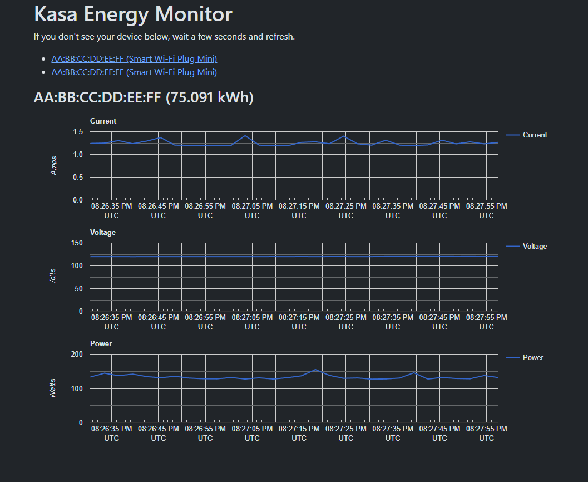

# KasaRESTAPI

This is a simple REST API that allows you to communicate with TP-Link Kasa devices on your local network. They don't need to be registered with an online account. They just need to be on the same network as your computer.

## Usage

Run KasaRESTAPI, and it will start listening on `localhost:5000`.

It will search your local network for any Kasa devices in the background. You can view a list of device it's found via the `/api/devices` endpoint, which will return a list of device names and MAC addresses.

Once you've identified the device you want to communicate with, you'll use its MAC address in the requests.

To get the energy monitoring stats from smart plugs that support this feature, use the `/api/MAC_ADDRESS/energymonitor` endpoint with the MAC address for the smart plug in question.

To view the state of a smart plug's outlet, use the `/api/MAC_ADDRESS/outlet` endpoint. You can also turn the outlet `on`, `off`, or `toggle` it from this endpoint by adding the new state after `outlet`, like `outlet/toggle`.

## Energy Monitor Web UI

I wrote this REST API to make it easier to interface with smart plugs that have energy monitoring to get a better idea of how much power certain devices were drawing. To make this easier to visualize, I wrote a small web UI that uses the API and Google Charts to show energy monitoring stats.

To access it, simply run KasaRESTAPI and visit `http://localhost:5000` in a browser. It will then let you pick from a list of devices that the server was able to locate on the network, and graph their energy monitoring stats.

